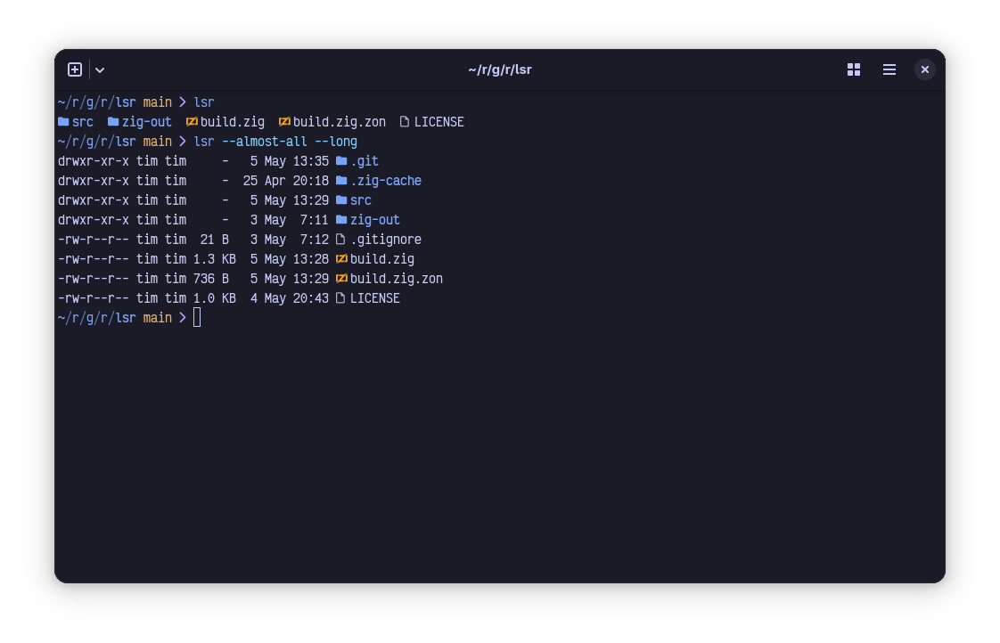

# lsr

`ls(1)` but with io_uring



## Installation

`lsr` uses the zig build system. To install, you will need zig 0.14.0. To
install for the local user (assuming `$HOME/.local/bin` is in `$PATH`), run:

```sh
zig build -Doptimize=ReleaseSmall --prefix $HOME/.local
```

which will install `lsr` and the associated manpage appropriately. Replace
`$HOME/.local` with your preferred installation directory.

## Benchmarks

Benchmarks were all gathered on the same set of directories, using the latest
releases of each program (versions are shown below). All benchmarks run on Linux
(because io_uring). `lsr` does work on macOS/BSD as well, but will not see the
syscall batching benefits that are available with io_uring.

| Program | Version |
|:-------:|:-------:|
|   lsr   |  0.1.0  |
|    ls   |   9.7   |
|   eza   |  0.21.3 |
|   lsd   |  1.1.5  |
| uutils  | 0.0.30  |

### Time

Data gathered with `hyperfine` on a directory of `n` plain files.

|    Program    |   n=10   |   n=100  | n=1,000 | n=10,000 |
|:-------------:|:--------:|:--------:|:-------:|:--------:|
|    lsr -al    | 372.6 µs | 634.3 µs | 2.7 ms  | 22.1 ms  |
|     ls -al    |  1.4 ms  |  1.7 ms  | 4.7 ms  | 38.0 ms  |
|    eza -al    |  2.9 ms  |  3.3 ms  | 6.6 ms  | 40.2 ms  |
|    lsd -al    |  2.1 ms  |  3.5 ms  | 17.0 ms | 153.4 ms |
| uutils ls -al | 2.9 ms   | 3.6 ms   | 11.3 ms | 89.6 ms  |

### Syscalls

Data gathered with `strace -c` on a directory of `n` plain files. (Lower is better)

|    Program    | n=10 | n=100 | n=1,000 | n=10,000 |
|:-------------:|:----:|:-----:|:-------:|:--------:|
|    lsr -al    |  20  |   28  | 105     | 848      |
|     ls -al    |  405 |  675  | 3,377   | 30,396   |
|    eza -al    |  319 |  411  | 1,320   | 10,364   |
|    lsd -al    |  508 | 1,408 | 10,423  | 100,512  |
| uutils ls -al | 445  | 986   | 6,397   | 10,005   |
